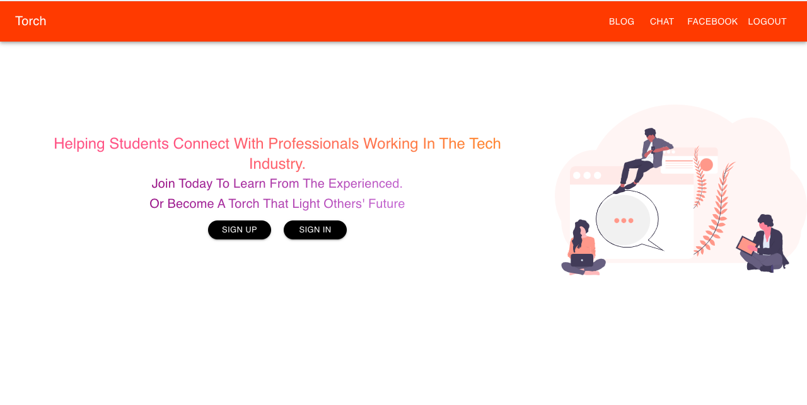
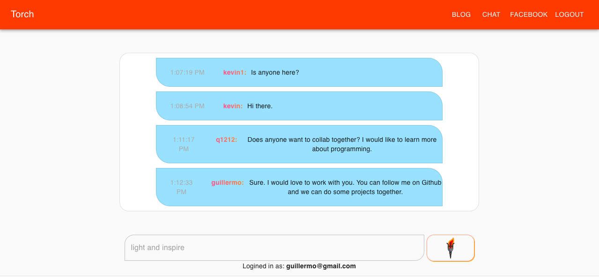

# Hackathon project
This project is created for the [Open Hacks hackathon](https://hack.theopencode.org/) from May 23 to May 24, 2020. It's a 24 hours virtual hackathon that focuses on collaboration and innovation.

## Torch

We application name is Torch. Torch is a web application that engages people insterested in programming in online communities and help them foster connections.

We worked as a group of four to build this web application under 24 hours constraint. We conceived this idea during our discussion via Zoom and decided to use React for the front-end and Firebase for the logic.

## Contribution

My contributions are

1. the Landing page UI and

2. the Chat Room functionality.

For the landing page UI, I used reusable components from [Material-UI](https://material-ui.com/) library to create the skeleton.

The Chat Room functionality is implemented using React and firebase API.

## Conclusion

I learned a lot from this hackathon and would continue learning software development to build better applications.
